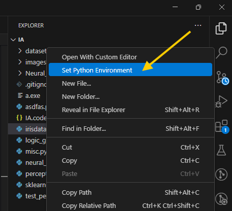
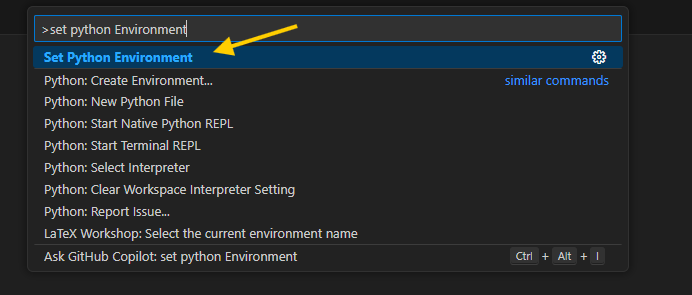
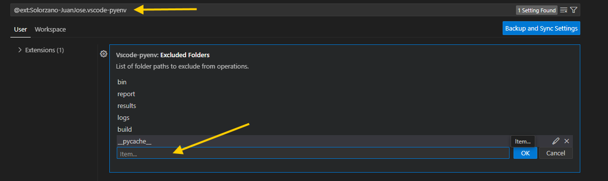

# 🚀 VSCode Python Environment Manager

The **VSCode Python Environment Manager** extension automates the creation of a Visual Studio Code workspace file for Python projects. It simplifies the process of configuring Python paths, debugging settings, and environment variables for your workspace.

## ✨ Features

- 🔍 Automatically scans the workspace for Python files and adds their paths to the workspace configuration.
- 🚫 Excludes specific folders (e.g., `__pycache__`, `logs`, `build`) from the workspace.
- 📄 Generates a `.env` file with the `PYTHONPATH` variable for easy environment configuration.
- 🛠️ Creates a `pyenv.py` script to manage Python environment paths and execute scripts.
- 🐞 Configures debugging settings for Python files.
- 🧠 Automatically detects the active Python interpreter.

## 🛡️ Usage

1. Open a Python project in Visual Studio Code.
2. Run the **`Set Python Environment`** command from the Command Palette (`Ctrl+Shift+P` or `Cmd+Shift+P`), or `right-click` within the Explorer view and select **`Set Python Environment`** from the context menu.
2. Run the command  from the Command Palette (`Ctrl+Shift+P` or `Cmd+Shift+P`) Or right-click on the Explorer view and select the option `Set Python Environment`
3. The extension will:
   - 📂 Create a `.code-workspace` file in the root of your workspace.
   - 🌐 Generate a `.env` file with the `PYTHONPATH` variable.
   - 📝 Create a `pyenv.py` script in the Python interpreter's `Lib` directory.
4. The workspace file will be opened automatically in Visual Studio Code.

## ⚙️ Configuration

### 🗂️ Excluded Folders

The following folders are excluded from the workspace configuration by default:
- `bin`
- `report`
- `results`
- `logs`
- `build`
- `__pycache__`

You can modify the `EXCLUDE_FOLDERS` array in the extension settings to customize this behavior:

### 🐍 Python Interpreter

The extension automatically detects the active Python interpreter using the Python extension (`ms-python.python`). Ensure the Python extension is installed and activated in your Visual Studio Code.

## 📜 License

This project is licensed under the MIT License. See the [LICENSE](LICENSE) file for details.

## 👨‍💻 Author

**Juan Jose Solorzano**  
Copyright (c) 2025

